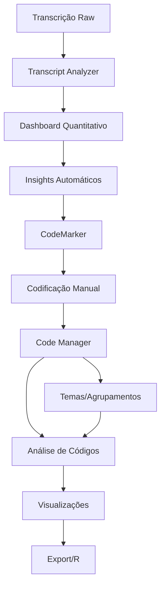

# Arquitetura CAQDAS Obsidian
## Sistema Completo de Análise Qualitativa

### 🎯 Visão Geral



### 📊 Níveis de Análise

#### Nível 1: Texto → Números
- **Transcript Analyzer** faz análise automática
- Sentimentos, tópicos, padrões linguísticos
- Dashboard com métricas iniciais
- "Diagnóstico rápido" da entrevista

#### Nível 2: Insights → Codificação
- **CodeMarker** para codificação manual
- Sugestões baseadas na análise automática
- Interface visual para marcar trechos
- Gestão de códigos

#### Nível 3: Códigos → Padrões
- **Code Manager** (novo módulo!)
- Agrupamento em temas
- Hierarquia flexível
- Análise de coocorrências

#### Nível 4: Padrões → Teoria
- Visualizações avançadas
- Saturação teórica
- Comparação entre entrevistas
- Export para análise estatística

## 🔧 Implementação Técnica

### Estrutura de Dados

```typescript
// Modelo de dados unificado
interface QualitativeProject {
    id: string;
    name: string;
    interviews: Interview[];
    codes: CodeSystem;
    analyses: Analysis[];
}

interface Interview {
    id: string;
    file: string;
    transcript: string;
    metadata: {
        date: Date;
        participant: string;
        duration: number;
    };
    segments: CodedSegment[];
    analysis: TranscriptAnalysis;
}

interface CodeSystem {
    codes: Code[];
    themes: Theme[];
    relationships: CodeRelationship[];
}

interface Code {
    id: string;
    name: string;
    color: string;
    description?: string;
    parentId?: string; // Para hierarquia
    frequency: number;
    segments: string[]; // IDs dos segmentos
}

interface Theme {
    id: string;
    name: string;
    codeIds: string[];
    subThemes?: Theme[];
    level: number; // Profundidade na hierarquia
}
```

### Gestão de Códigos/Temas

```typescript
// code-manager.ts
export class CodeManager {
    // Agrupa códigos em tema
    createTheme(name: string, codeIds: string[]): Theme {
        return {
            id: generateId(),
            name,
            codeIds,
            level: 0
        };
    }
    
    // Merge códigos
    mergeCodes(sourceIds: string[], targetName: string): Code {
        // Combina todos os segmentos
        const allSegments = sourceIds.flatMap(id => 
            this.getCode(id).segments
        );
        
        // Cria novo código
        const merged = this.createCode(targetName);
        merged.segments = [...new Set(allSegments)];
        
        // Remove códigos antigos
        sourceIds.forEach(id => this.deleteCode(id));
        
        return merged;
    }
    
    // Hierarquia flexível
    nestCode(codeId: string, parentId: string) {
        const code = this.getCode(codeId);
        code.parentId = parentId;
        this.updateCode(code);
    }
    
    // Análise de coocorrência
    analyzeCooccurrence(codeIds: string[]): CooccurrenceMatrix {
        const matrix: number[][] = [];
        
        for (let i = 0; i < codeIds.length; i++) {
            matrix[i] = [];
            for (let j = 0; j < codeIds.length; j++) {
                matrix[i][j] = this.calculateCooccurrence(
                    codeIds[i], 
                    codeIds[j]
                );
            }
        }
        
        return { codeIds, matrix };
    }
}
```

### Visualizações Avançadas

```typescript
// visualizations/code-analysis.ts
export class CodeAnalysisVisualizer {
    // Gráfico de saturação
    renderSaturationCurve(project: QualitativeProject) {
        const saturationData = project.interviews.map((interview, index) => {
            const uniqueCodes = new Set();
            project.interviews.slice(0, index + 1).forEach(int => {
                int.segments.forEach(seg => uniqueCodes.add(seg.codeId));
            });
            
            return {
                interview: index + 1,
                uniqueCodes: uniqueCodes.size,
                newCodes: index === 0 ? uniqueCodes.size : 
                    uniqueCodes.size - this.getPreviousCount(index)
            };
        });
        
        // Plotly chart
        return {
            data: [{
                x: saturationData.map(d => d.interview),
                y: saturationData.map(d => d.uniqueCodes),
                name: 'Códigos Únicos Acumulados',
                type: 'scatter'
            }, {
                x: saturationData.map(d => d.interview),
                y: saturationData.map(d => d.newCodes),
                name: 'Novos Códigos por Entrevista',
                type: 'bar'
            }],
            layout: {
                title: 'Curva de Saturação Teórica',
                xaxis: { title: 'Número da Entrevista' },
                yaxis: { title: 'Quantidade de Códigos' }
            }
        };
    }
    
    // Rede de códigos
    renderCodeNetwork(cooccurrence: CooccurrenceMatrix) {
        const nodes = cooccurrence.codeIds.map(id => ({
            id,
            label: this.getCodeName(id),
            size: this.getCodeFrequency(id)
        }));
        
        const edges = [];
        for (let i = 0; i < cooccurrence.matrix.length; i++) {
            for (let j = i + 1; j < cooccurrence.matrix[i].length; j++) {
                if (cooccurrence.matrix[i][j] > 0) {
                    edges.push({
                        source: cooccurrence.codeIds[i],
                        target: cooccurrence.codeIds[j],
                        weight: cooccurrence.matrix[i][j]
                    });
                }
            }
        }
        
        return { nodes, edges };
    }
    
    // Comparação entre entrevistas
    renderInterviewComparison(interviews: Interview[]) {
        const codeFrequencies = interviews.map(interview => {
            const frequencies: Record<string, number> = {};
            interview.segments.forEach(seg => {
                frequencies[seg.codeId] = (frequencies[seg.codeId] || 0) + 1;
            });
            return frequencies;
        });
        
        // Heatmap
        return {
            type: 'heatmap',
            data: codeFrequencies,
            layout: {
                title: 'Frequência de Códigos por Entrevista'
            }
        };
    }
}
```

### Export para R/SPSS

```typescript
// export/statistical-export.ts
export class StatisticalExporter {
    // Export para R
    exportToR(project: QualitativeProject): string {
        const rScript = `
# Qualitative Data Analysis - ${project.name}
# Generated by Obsidian CAQDAS

# Load libraries
library(FactoMineR)
library(factoextra)
library(tidyverse)

# Code frequency matrix
code_matrix <- matrix(c(
${this.generateCodeMatrix(project)}
), nrow = ${project.interviews.length}, byrow = TRUE)

colnames(code_matrix) <- c(${this.getCodeNames(project)})
rownames(code_matrix) <- c(${this.getInterviewNames(project)})

# Correspondence Analysis
ca_result <- CA(code_matrix)
fviz_ca_biplot(ca_result, repel = TRUE)

# Multiple Correspondence Analysis
mca_data <- as.data.frame(code_matrix > 0)
mca_result <- MCA(mca_data)
fviz_mca_var(mca_result)

# Cluster Analysis
dist_matrix <- dist(code_matrix, method = "euclidean")
hclust_result <- hclust(dist_matrix, method = "ward.D2")
plot(hclust_result)
`;
        return rScript;
    }
    
    // Export CSV para SPSS/Excel
    exportToCSV(project: QualitativeProject): string {
        const headers = ['Interview', ...this.getAllCodes(project)];
        const rows = project.interviews.map(interview => {
            const row = [interview.metadata.participant];
            this.getAllCodes(project).forEach(code => {
                const count = interview.segments.filter(s => 
                    s.codeId === code.id
                ).length;
                row.push(count.toString());
            });
            return row;
        });
        
        return [headers, ...rows].map(r => r.join(',')).join('\n');
    }
    
    // Export para QDA format (intercâmbio com outros CAQDAS)
    exportToQDA(project: QualitativeProject): XML {
        // REFI-QDA format padrão
        return this.generateREFIQDA(project);
    }
}
```

## 🎨 Interface Unificada

### Dashboard Principal

```typescript
// views/caqdas-dashboard.ts
export class CAQDASView extends ItemView {
    renderDashboard() {
        // Tabs principais
        const tabs = [
            { id: 'overview', label: 'Visão Geral', icon: 'layout-dashboard' },
            { id: 'transcripts', label: 'Transcrições', icon: 'file-text' },
            { id: 'codes', label: 'Códigos', icon: 'tags' },
            { id: 'themes', label: 'Temas', icon: 'folder-tree' },
            { id: 'analysis', label: 'Análises', icon: 'chart-bar' },
            { id: 'export', label: 'Exportar', icon: 'download' }
        ];
        
        // Conteúdo dinâmico baseado na aba
        this.renderTabContent(this.activeTab);
    }
    
    renderCodesTab() {
        // Lista de códigos com drag-and-drop
        // Botões para merge, agrupar, criar tema
        // Mini visualizações inline
    }
    
    renderAnalysisTab() {
        // Gráficos interativos
        // Saturação, coocorrência, comparações
        // Filtros por entrevista/código/tema
    }
}
```

## 🚀 Roadmap de Implementação

### Fase 1: MVP Integrado
1. Transcript Analyzer básico ✓
2. CodeMarker básico ✓
3. Integração simples entre eles
4. Export básico CSV

### Fase 2: Gestão de Códigos
1. Interface para merge/agrupar
2. Hierarquia de temas
3. Drag-and-drop
4. Busca e filtros

### Fase 3: Análises Avançadas
1. Visualizações de coocorrência
2. Saturação teórica
3. Comparações
4. Dashboard unificado

### Fase 4: Export Profissional
1. Scripts R prontos
2. Formato REFI-QDA
3. Templates de análise
4. Integração com Zotero

## 💡 Diferenciais do Sistema

### vs NVivo/MAXQDA
- **Gratuito e open source**
- **Integrado ao Obsidian** (seu PKM)
- **Markdown nativo** (portabilidade)
- **Análise automática** incluída
- **Customizável** via plugins

### vs Atlas.ti
- **Offline first**
- **Sem licenças**
- **Visualizações modernas**
- **Export para R** direto
- **Comunidade ativa**

## 🎯 Conclusão

Este sistema transformaria Obsidian no **CAQDAS mais moderno e acessível** disponível. A combinação de:

1. Análise automática (Transcript Analyzer)
2. Codificação manual (CodeMarker)
3. Gestão avançada de códigos
4. Visualizações interativas
5. Export estatístico

Criaria uma ferramenta completa para pesquisa qualitativa, mantendo a filosofia Obsidian de dados locais e portáveis.

**Próximo passo**: Começar com a integração básica entre os dois plugins e ir evoluindo incrementalmente!